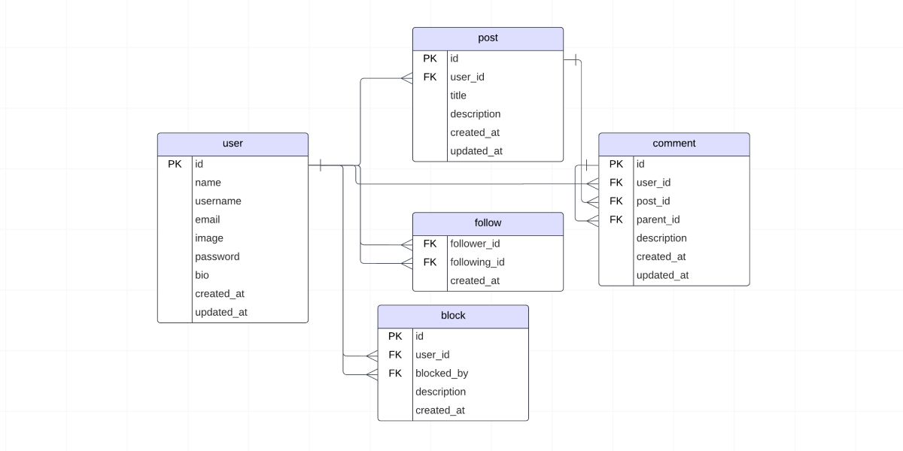

# Silkroad 🛤️

Silkroad is a CRUD API built with Express.js and TypeScript.

## Features 🚀

✅ **Powered by Express.js**: Built using Express.js for a fast and reliable HTTP server.

🔄 **Type Safety with TypeScript**: Developed using TypeScript for robust type checking.

🔐 **JWT Authentication**: Provides secure authentication using JSON Web Tokens (JWT).

🔒 **Security-focused**: Security measures implemented using packages like Helmet and CORS.

## Used Packages 📦

- **Express.js**: Fast web server framework for web applications.
- **TypeScript**: A programming language that provides strong type checking for JavaScript.
- **NeonDatabase/serverless**: Integration for serverless database management with NeonDatabase.
- **JWT (JSON Web Token)**: Token-based authentication for secure authorization.
- **Drizzle ORM**: Object-Relational Mapping (ORM) library for easy database access and management.
- **bcrypt**: Used for hashing and comparing passwords.
- **helmet**: Increases security by setting HTTP headers.
- **cors**: Middleware for enabling Cross-Origin Resource Sharing (CORS) in Express.js.
- **dotenv**: Loads environment variables from a .env file into process.env.
- **morgan**: HTTP request logger middleware.
- **jsonwebtoken**: Used for creating and verifying JSON Web Tokens (JWT).
- **zod**: A TypeScript-first schema validation library.

## Database relations 🪢

## Routes 🛣️

### Auth 🔐

- `POST /auth/signup`: Creates a new user account.
- `POST /auth/login`: Logs in an existing user.
- `POST /auth/logout`: Logs out the currently authenticated user.
- `GET /auth/get-me`: Retrieves details of the currently authenticated user.

### Comments 💬

- `GET /comments/:id`: Retrieves details of a specific comment.
- `POST /comments/:id/create`: Creates a new comment.
- `DELETE /comments/:id`: Deletes a comment.
- `PUT /comments/:id`: Updates a comment.

### Posts 📝

- `GET /posts/`: Retrieves all posts.
- `POST /posts/create`: Creates a new post.
- `DELETE /posts/:id`: Deletes a post.
- `GET /posts/:id`: Retrieves details of a specific post.
- `PUT /posts/:id`: Updates a post.

### Users 👥

- `GET /users/`: Retrieves all users.
- `GET /users/:username`: Retrieves details of a user by username.
- `PUT /users/:id/update`: Updates the profile of a user by ID.
- `POST /users/:id/follow`: Follows a user by ID.
- `POST /users/:id/unfollow`: Unfollows a user by ID.
- `POST /users/ban`: Bans a user by ID.
- `POST /users/:id/unban`: Unbans a user by ID.

## Installation and Running ⚙️

1. Navigate to the project directory: `cd silkroad`
2. Install dependencies: `npm install`
3. To run in development mode: `npm run dev`
4. To run in production: `npm start`

## License 📄

This project is licensed under the MIT License.
